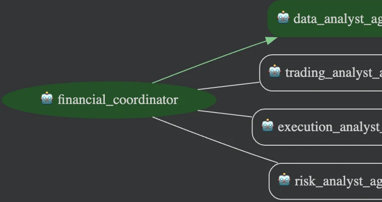

# Financial Advisor

## Overview

The Financial Advisor is a team of specialized AI agents that assists human financial advisors.

1. Data Analyst Agent: This agent is responsible for creating in-depth and current market analysis reports for specific stock tickers. It achieves this by repeatedly using Google Search to find a predetermined amount of unique, recent (within a given timeframe), and insightful information. The agent focuses on gathering both SEC filings and broader market intelligence via Google Search tool, which it then uses to compile a structured report based solely on the collected data.

2. Trading Analyst Agent: This agent's task is to develop and describe at least five different trading strategies. It does this by carefully reviewing the comprehensive market analysis provided by the Data Analyst Agent. Each proposed strategy must be customized to match the user's declared risk tolerance and intended investment duration.

3. Execution Agent: This agent creates a thorough and well-justified plan for implementing a given trading strategy. The plan must be carefully adjusted to fit the user's risk tolerance, investment timeframe, and preferred methods of execution. The output will be detailed and fact-based, examining the best approaches and specific timing for initiating, maintaining, adding to, partially selling, and completely exiting investment positions.

4. Risk Evaluation Agent: This agent's role is to produce a detailed and reasoned analysis of the risks associated with a specific trading strategy and its execution plan. This analysis needs to be precisely aligned with the user's stated risk tolerance, investment period, and execution preferences. The output will be rich in factual analysis, clearly outlining all identified risks and suggesting concrete, actionable steps to lessen their impact.

The coordinator (`financial_coordinator`) is deployed to **Vertex AI Agent
Engine** two ways — as a plain **ADK** app (`financial-advisor-adk`,
`streamQuery`) and as an **A2A**-wrapped agent (`financial-advisor-a2a`,
`message:send`) — both behind the same Agent Gateway with a Model Armor
policy attached. See **[Responsible AI, Agent Gateway & Model Armor](#responsible-ai-agent-gateway--model-armor)**
below.

**Legal Disclaimer and User Acknowledgment**

Important Disclaimer: For Educational and Informational Purposes Only.

The information and trading strategy outlines provided by this tool, including any analysis, commentary, or potential scenarios, are generated by an AI model and are for educational and informational purposes only. They do not constitute, and should not be interpreted as, financial advice, investment recommendations, endorsements, or offers to buy or sell any securities or other financial instruments.

Google and its affiliates make no representations or warranties of any kind, express or implied, about the completeness, accuracy, reliability, suitability, or availability with respect to the information provided. Any reliance you place on such information is therefore strictly at your own risk.

This is not an offer to buy or sell any security. Investment decisions should not be made based solely on the information provided here. Financial markets are subject to risks, and past performance is not indicative of future results. You should conduct your own thorough research and consult with a qualified independent financial advisor before making any investment decisions.

By using this tool and reviewing these strategies, you acknowledge that you understand this disclaimer and agree that Google and its affiliates are not liable for any losses or damages arising from your use of or reliance on this information.

## Agent Details

The key features of the Financial Advisor include:

| Feature | Description |
| --- | --- |
| **Interaction Type** | Conversational |
| **Complexity**  | Medium |
| **Agent Type**  | Multi Agent |
| **Components**  | Tools: built-in Google Search |
| **Vertical**  | Financial |

### Agent architecture

This diagram shows the detailed architecture of the agents and tools used
to implement this workflow.


## Project structure

```
financial-advisor/
├── financial_advisor/          # Agent package (google-adk)
│   ├── agent.py                 # financial_coordinator (root_agent) + AgentTool wiring
│   ├── prompt.py
│   ├── sub_agents/               # data_analyst, trading_analyst, execution_analyst, risk_analyst
│   ├── adk_app.py                # FinancialAdvisorAdkApp (Agent Engine set_up rebuild)
│   ├── adk_stream.py             # streamQuery SSE helpers + Model Armor block detection
│   ├── a2a_config.py             # A2A agent card
│   ├── a2a_executor.py           # A2A ↔ ADK bridge (FinancialAdvisorAgentExecutor)
│   └── a2a_task_store.py         # GCS-backed A2A TaskStore (multi-worker Agent Engine)
├── deployment/
│   └── deploy.py                 # create/update/delete for both ADK and A2A deployments
├── tests/
│   ├── unit/                     # fast, no GCP calls
│   └── live/                     # pytest -m live — hits the deployed Reasoning Engines
├── eval/                          # ADK AgentEvaluator dataset + test
├── docs/
│   ├── responsible-ai/           # Agent Gateway, Model Armor, SCC — start at README.md
│   ├── agent-registry.md
│   └── example-interaction.md
└── assets/
```

## Setup and Installation

1.  **Prerequisites**

    *   Python 3.10+
    *   uv
        *   For dependency management and packaging. Please follow the
            instructions on the official
            [uv website](https://docs.astral.sh/uv/) for installation.

        ```bash
        curl -LsSf https://astral.sh/uv/install.sh | sh
        ```

    * A project on Google Cloud Platform
    * Google Cloud CLI
        *   For installation, please follow the instruction on the official
            [Google Cloud website](https://cloud.google.com/sdk/docs/install).

2.  **Installation**

    ```bash
    git clone <this-repository-url>
    cd financial-advisor
    # Install the package and dependencies.
    uv sync
    ```

3.  **Configuration**

    *   Set up Google Cloud credentials.

        *   You may set the following environment variables in your shell, or in
            a `.env` file instead (see `.env.example`).

        ```bash
        export GOOGLE_GENAI_USE_VERTEXAI=true
        export GOOGLE_CLOUD_PROJECT=<your-project-id>
        export GOOGLE_CLOUD_LOCATION=<your-project-location>
        export GOOGLE_CLOUD_STORAGE_BUCKET=<your-storage-bucket>  # Only required for deployment on Agent Engine
        ```

    *   Authenticate your GCloud account.

        ```bash
        gcloud auth application-default login
        gcloud auth application-default set-quota-project $GOOGLE_CLOUD_PROJECT
        ```

## Running the Agent

**Using `adk`**

ADK provides convenient ways to bring up agents locally and interact with them.
You may talk to the agent using the CLI:

```bash
adk run financial_advisor
```

Or on a web interface:

```bash
 adk web
```

The command `adk web` will start a web server on your machine and print the URL.
You may open the URL, select "financial_advisor" in the top-left drop-down menu, and
a chatbot interface will appear on the right. The conversation is initially
blank. Try `who are you` or `Analyze AAPL` to get started — a full sampled
run through all four steps is in **[docs/example-interaction.md](docs/example-interaction.md)**.

## Running Tests

For running tests and evaluation, install the extra dependencies:

```bash
uv sync --dev
```

Then, from the repo root:

```bash
uv run pytest tests/unit
uv run pytest eval
```

`tests/unit` runs the agent and its Agent Engine/A2A wiring on fast, offline
checks (no GCP calls). `eval` is a demonstration of how to evaluate the
agent, using the `AgentEvaluator` in ADK — it sends a couple of requests to
the agent and expects that the agent's responses match a pre-defined
response reasonably well.

**Live tests** (`tests/live`) exercise the actual deployed Reasoning
Engines — the Playground-equivalent `streamQuery` (ADK) and `message:send`
(A2A) paths — and need `gcloud auth application-default login` plus the
deployed resource IDs. They're excluded by default (see
`addopts` in `pyproject.toml`) and opted into explicitly:

```bash
uv run pytest -m live tests/live -v
```

## Deployment

The Financial Advisor can be deployed to Agent Engine as an **ADK** app, an
**A2A** agent, or both — they're independent Reasoning Engine resources
that can coexist.

```bash
uv sync --group deployment

# ADK deployment (streamQuery)
uv run deployment/deploy.py --create

# A2A deployment (message:send / tasks.get)
uv run deployment/deploy.py --create_a2a
```

When the deployment finishes, it will print a line like this:

```
Created ADK remote agent: projects/<PROJECT_NUMBER>/locations/<PROJECT_LOCATION>/reasoningEngines/<AGENT_ENGINE_ID>
```

If you forgot the AGENT_ENGINE_ID, you can list existing agents using:

```bash
uv run deployment/deploy.py --list
```

To update an existing deployment (code, dependencies, telemetry, or the
Agent Gateway/Model Armor wiring in `deployment/deploy.py`):

```bash
uv run deployment/deploy.py --update --resource_id=${AGENT_ENGINE_ID}       # ADK
uv run deployment/deploy.py --update_a2a --resource_id=${AGENT_ENGINE_ID}   # A2A
```

To delete a deployed agent:

```bash
uv run deployment/deploy.py --delete --resource_id=${AGENT_ENGINE_ID}
```

**To interact with a deployed agent**, use the Agent Engine console's
**Playground** tab for the resource (Cloud Console → Vertex AI → Agent
Engine → the agent's display name), or run the corresponding live pytest
suite (`tests/live/test_adk_playground_live.py` /
`tests/live/test_a2a_playground_live.py`) against its resource ID.

### Alternative: Using Google Agents CLI

You can also use the [Google Agents CLI](https://github.com/google/agents-cli) to create a production-ready version of this agent with additional deployment options.

**Install the CLI** (one-time):

```bash
uvx google-agents-cli setup
```

**Create the project from this sample** (replace `my-financial-advisor` with your project name):

```bash
agents-cli create my-financial-advisor -a adk@financial-advisor
```

The Google Agents CLI will prompt you to select deployment options and provides additional production-ready features including automated CI/CD deployment scripts.

## Responsible AI, Agent Gateway & Model Armor

Both deployments sit behind an **Agent Gateway** (`financial-advisor-ingress-gw`)
with a **Model Armor** policy (`financial-advisor-security`) attached, plus
project-level Model Armor **floor settings** on every Gemini call the agent
makes. The two deployment types get materially different protection —
Gateway Model Armor only screens ADK `streamQuery` ingress today, not A2A
`message:send` — and the Agent Engine console's Security tab does not
reliably reflect what Model Armor is actually catching.

The full investigation — architecture, request/response flow diagrams,
per-deployment findings, a five-prompt red-team pass with live Cloud
Logging evidence, and the specific gaps that need a Google Cloud support
conversation — is in **[docs/responsible-ai/README.md](docs/responsible-ai/README.md)**.

## Customization

1. Enhance Data_Analyst Module Search Capabilities with Specialized Stock Repositories:
To empower the data_analyst module with more comprehensive insights, expand its search functionality to directly access and integrate with specialized stock-related data repositories. This would involve connecting to databases, APIs, or data lakes containing real-time and historical stock prices, trading volumes, company financial statements (e.g., income statements, balance sheets, cash flow statements), news articles, analyst ratings, and potentially alternative data sources (e.g., satellite imagery for supply chain analysis, social media sentiment). The goal is to provide data analysts with a richer, more granular, and domain-specific dataset to perform in-depth market research, trend analysis, and predictive modeling.
2. Establish and Implement Diverse Analyst Personas for Tailored Access and Functionality:
Systematically define and implement a broader range of analyst personas or role-based access configurations tailored to specific analytical needs and organizational structures. This involves identifying different types of data analysts (e.g., quantitative analysts, fundamental analysts, risk analysts, compliance analysts, market researchers) and mapping their unique data access requirements, tool functionalities, and reporting needs. By assigning specific roles or personas, the system can ensure that each analyst has access only to the relevant data, tools, and features necessary for their tasks, improving security, streamlining workflows, and preventing information overload. This also allows for the customization of user interfaces and analytical dashboards to better suit the preferences and expertise of each persona.
3. Iteratively Refine Prompt Engineering for Optimal Result Precision and Relevance:
Continuously iterate on the strategies and techniques used in prompt engineering to elicit more precise, relevant, and actionable results from generative AI models or search algorithms. This process involves experimenting with various prompt structures, keywords, contextual information, examples, and constraints to guide the AI towards producing outputs that directly address the user's intent and specific information requirements. Regular feedback loops, A/B testing of different prompts, and ongoing analysis of result quality are crucial to refine the prompts. The aim is to minimize irrelevant or inaccurate information, enhance the clarity and conciseness of the outputs, and ensure that the results are consistently aligned with the analytical objectives.
