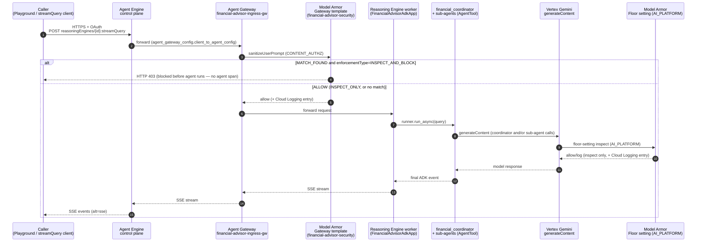
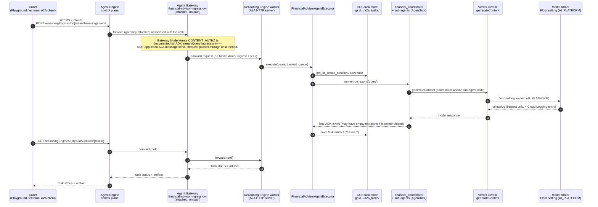

# 2. Request → response flow

**[← Controls overview](01-controls-overview.md)** | Next: [ADK findings](03-adk-deployment-findings.md)

## Contents

- [ADK flow: `streamQuery`](#adk-flow-streamquery)
- [A2A flow: `message:send`](#a2a-flow-messagesend)
- [Side-by-side step table](#side-by-side-step-table)

Both diagrams show the **full round trip** — caller in, GCP components in
the middle, agent response out — for one user turn. The only structural
difference between them is whether **Gateway Model Armor** sits in the path
at all; everything after "Reasoning Engine worker" is otherwise the same
ADK agent underneath.

## ADK flow: `streamQuery`

Used by the Agent Engine **Playground** (for the ADK agent) and any direct
`streamQuery` REST/SDK client.

**Key point:** Gateway Model Armor (`MA1`) is a real pre-agent checkpoint
here — a blocked prompt never reaches `financial_coordinator` at all, which
is exactly why a blocking verdict leaves no agent trace/span for the
console Security tab to attribute a finding to (see [page 3](03-adk-deployment-findings.md)).

## A2A flow: `message:send`

Used by the Agent Engine Playground (for the A2A agent) and any external
A2A client. Playground and external clients are indistinguishable to the
gateway — both use the same `message:send` / `tasks.get` shape.

**Key point:** there is no `MA1`-equivalent checkpoint in this diagram —
that's the actual gap, not a rendering omission. The only Model Armor
coverage A2A gets today is `MA2` (floor settings on the agent's own
`generateContent` calls), which is why [`a2a_executor.py`](../../financial_advisor/a2a_executor.py)
also does its own empty-final-response handling as a mitigation (see
[page 4](04-a2a-deployment-findings.md)).

## Side-by-side step table

| Step | ADK (`streamQuery`) | A2A (`message:send`) |
|---|---|---|
| 1. Caller → Agent Engine control plane | Yes | Yes |
| 2. Agent Gateway on path | Yes | Yes |
| 3. Gateway Model Armor screens ingress | **Yes** | **No** (product coverage gap) |
| 4. Reaches Reasoning Engine worker | If allowed by step 3 | Always (step 3 doesn't gate it) |
| 5. ADK coordinator + `AgentTool` sub-agents run | If allowed | Yes |
| 6. Floor-setting Model Armor screens `generateContent` | Yes | Yes |
| 7. Response returned to caller | SSE stream | Task artifact via poll |
